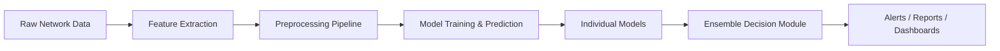

kaggle link::https://www.kaggle.com/code/bikrambarman9932/intrusion-detection


# Network Intrusion Detection System (NIDS) Using Ensemble Machine Learning

## **Project Overview**

The **Network Intrusion Detection System (NIDS)** identifies malicious network activity using a **hybrid ensemble approach**. The system combines **Gaussian Naive Bayes (GNB)**, **Decision Trees (DT)**, and **XGBoost (XGB)** to detect attacks with high accuracy and robustness.

---

## **Motivation**

* Cybersecurity threats are increasing in frequency and sophistication.
* Single-model approaches fail to generalize across diverse attacks.
* **Ensemble methods** improve accuracy, reduce false positives, and enhance robustness.

---

## **System Architecture (Flow Diagram)**
flowchart TD
    A[Network Traffic Data] --> B[Data Collection]
    B --> C[Data Preprocessing]
    C --> D1["Gaussian Naive Bayes"]
    C --> D2[Decision Tree]
    C --> D3[XGBoost]
    D1 --> E["Ensemble Module - Majority Voting"]
    D2 --> E
    D3 --> E
    E --> F[Detection Results & Alerts]


### **Step-by-Step Pipeline**

1. **Data Collection**

   * Capture network traffic using PCAP logs or streaming interfaces.
   * Extract key features like `duration`, `src_bytes`, `dst_bytes`, `protocol_type`, `flags`.

2. **Preprocessing**

   * **Label Encoding:** Converts categorical features into numeric values for ML models.
   * **Normalization:** MinMax scaling ensures features are on the same scale.
   * **Feature Selection:** Using **Mutual Information** to retain the most informative features.
   * **Dimensionality Reduction:** PCA reduces dimensionality while retaining variance.

3. **Model Training**

   * **Gaussian Naive Bayes (GNB):** Probabilistic model, fast and interpretable.
   * **Decision Tree (DT):** Handles feature interactions and non-linear patterns.
   * **XGBoost (XGB):** Gradient boosting for complex patterns, high accuracy.

4. **Ensemble Module**

   * Combines predictions from GNB, DT, and XGB via **majority voting**.
   * Reduces bias and variance, improving overall performance.

5. **Evaluation**

   * Metrics: Accuracy, Precision, Recall, F1-score, ROC-AUC.
   * Visualized via **Confusion Matrix** for insight into misclassifications.

---

## **System Components & Diagram**




### **Preprocessing Detail**

* **Categorical Variables:** `protocol_type`, `service`, `flag` → Label Encoding
* **Normalization:** `src_bytes`, `dst_bytes`, `count`, `srv_count` → 0–1 scale
* **Feature Selection:** Mutual Information identifies top predictors
* **PCA:** Reduce to top 10 principal components

---

## **Evaluation Metrics**

| Metric           | Purpose                                                   |
| ---------------- | --------------------------------------------------------- |
| Accuracy         | Overall correctness                                       |
| Precision        | Minimizes false positives                                 |
| Recall           | Detects true attacks (sensitivity)                        |
| F1-score         | Balance between precision and recall                      |
| ROC-AUC          | Measures trade-off between true positive & false positive |
| Confusion Matrix | Visualize true/false positives and negatives              |

---

## **Deployment Architecture**

flowchart TD
    A["Internet Traffic"] --> B["Firewall"]
    B --> C["Feature Extractor"]
    C --> D["Preprocessing"]
    D --> E["ML Models (GNB, DT, XGBoost)"]
    E --> F["Ensemble Module"]
    F --> G["Alert System"]
    G --> H["Admin Dashboard"]


* **Batch Mode:** Analyze stored PCAP files.
* **Streaming Mode:** Real-time packet capture via Kafka/Spark/Flink.
* **Alerting:** Sends email or dashboard alerts for malicious activity.
* **Retraining:** Periodically update models with new attack signatures.

---

## **Why This Ensemble?**

| Model | Strengths                               | Weaknesses                   | Role in Ensemble                          |
| ----- | --------------------------------------- | ---------------------------- | ----------------------------------------- |
| GNB   | Fast, interpretable                     | Assumes feature independence | Detects known attacks quickly             |
| DT    | Handles feature interactions            | Can overfit                  | Captures simple and non-linear patterns   |
| XGB   | High accuracy, handles complex patterns | Slower training              | Detects subtle or complex attack patterns |

**Ensemble Benefits**

* Combines complementary strengths of models.
* Improves accuracy and robustness.
* Reduces bias and variance compared to individual models.

---

## **Example Workflow**

```python
# Preprocess
df_clean = encode_df(df_raw)

# Train GNB
gnb_model.fit(X_train, y_train)

# Train Decision Tree
dt_tree = build_tree(train_data)

# Train XGBoost
xgb_model.fit(X_train, y_train)

# Ensemble Prediction (Majority Voting)
y_pred_ensemble = np.array([np.bincount(tup).argmax() 
                            for tup in zip(gnb_preds, dt_preds, xgb_preds)])
```

---

## **Challenges & Solutions**

| Challenge           | Solution / Research Angle                            |
| ------------------- | ---------------------------------------------------- |
| Imbalanced dataset  | Stratified splitting, ensemble voting                |
| Zero-day attacks    | Potential autoencoder integration                    |
| High-speed traffic  | Parallel preprocessing and inference                 |
| False positives     | Ensemble reduces bias, threshold tuning              |
| Adversarial evasion | Future work: adversarial training, anomaly detection |

---

## **Future Improvements**

* Integrate **Autoencoders / LSTM** for anomaly detection.
* Real-time **streaming analytics** with Spark/Flink.
* **Explainable AI**: Use SHAP/LIME to explain attack predictions.
* Extend dataset for **zero-day attack detection**.

---


## **Authors**

* **Bikram Barman**


---

## **License**

MIT License

